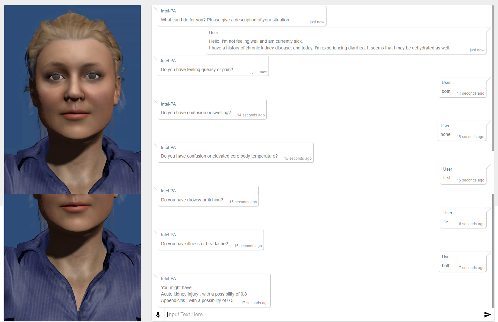

# Dialogue-based-self-diagnosis

## Screenshot and demonstration video:

#### Screenshot

#### demonstration video

The video demo can be found at: [Demo](https://drive.google.com/file/d/1HlgtIaVTiGY7xNVuruDLeJ9FHRvo8iw0/view?usp=sharing)

## The dialogue history can be found as follows:

System: What can I do for you? Please give a description of your situation.

Response: chronic kidney disease, sick, diarrhoea, dehydration

System: Do you have feeling queasy or pain?

Response:both

System: Do you have confusion or swelling?

Response:none

System: Do you have confusion or elevated core body temperature?

Response:first

System: Do you have drowsy or itching?

Response:first

System: Do you have illness or headache?

Response:both

You might have 
Acute kidney injury: with a possibility of 0.8
Appendicitis: with a possibility of 0.5.

